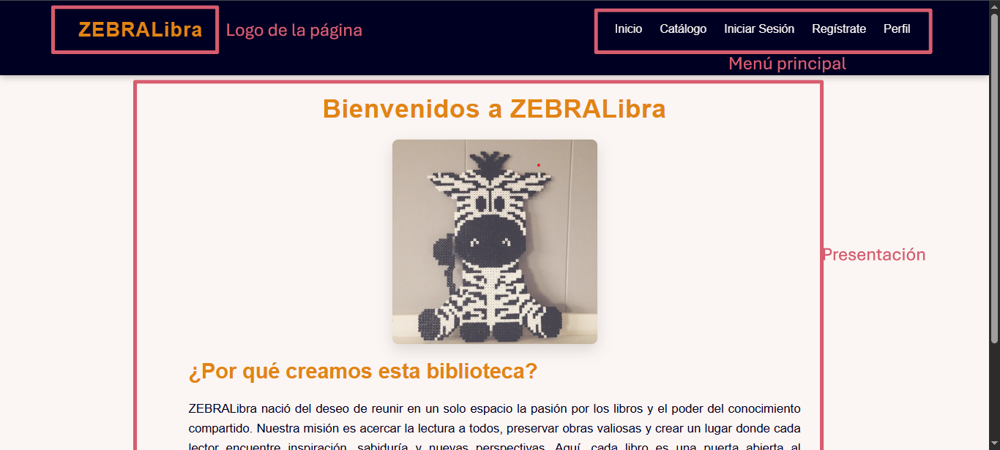
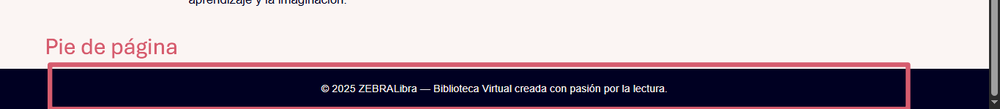

# ZEBRALibra: Biblioteca Virtual
ZEBRALibra es una página web con el propósito de divulgar libros de distintos géneros letarios vía online (mediante conexión remota a una página oficial de venta de libros). A continuación, se presentan las instrucciones para su uso:
## Índice

El índice está formado por tres pates (así como todas las demás páginas que conforman a ZEBRALibra): cabecera, donde está el logo de la página y el menú principal; el cuerpo de la página, donde se pondrá el contenido principal; y el pie de página, que imita los derechos de autor con un pequeño mensaje.